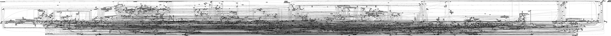
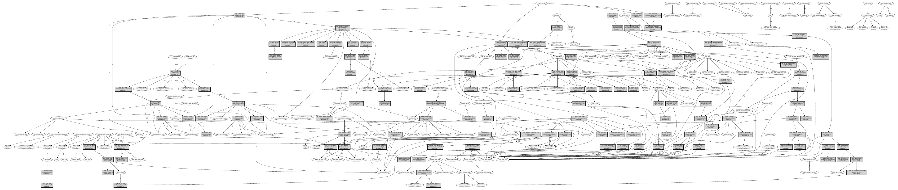
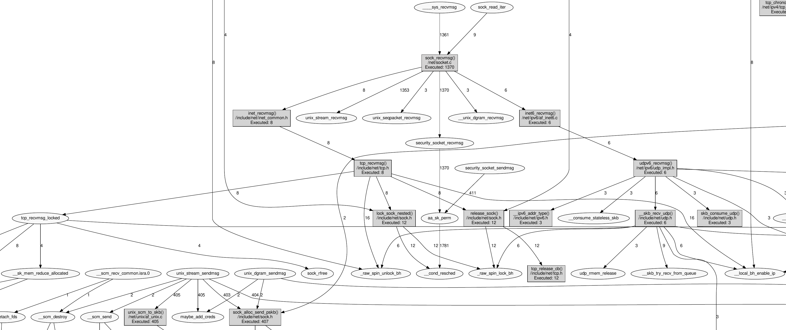
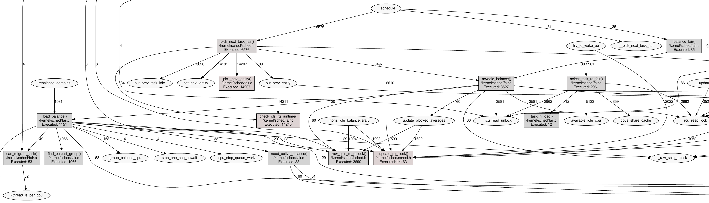
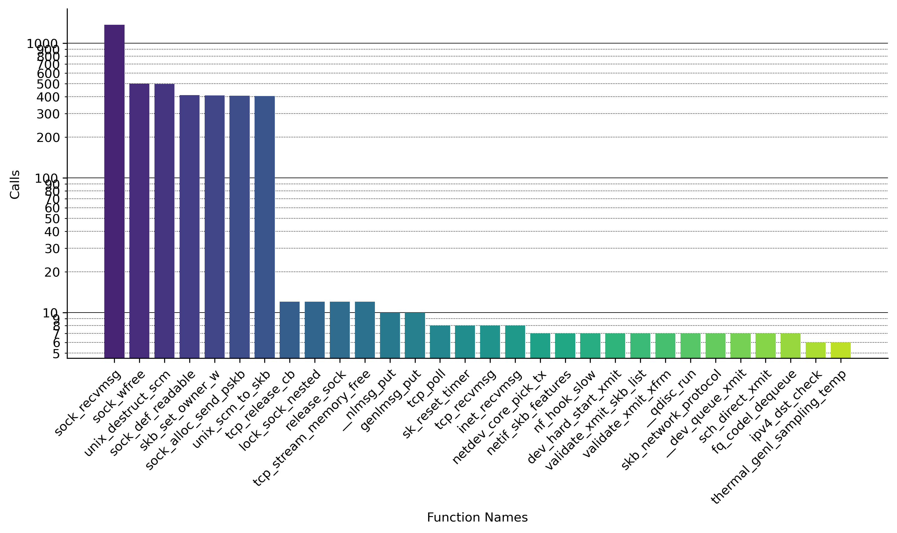

<p align="center">
  <br>
</p>

*A Linux Kernel Execution Flow Research Tool for Upcomming Kernel Hackers (and Veterans)*

## Background - Problem Statement

You are new to Linux kernel development and want to develop a driver,
contribute new network stack functionality, better understand the complex
process scheduler or just chase a kernel bug - then the Kernel Magnifier could
provide some support.

Many developers new to the Linux kernel development find it difficult to
understand the kernel. The kernel is a beast of its own. It is not simple
code, on the contrary: even if you have mastered programming languages such as
C/C++ with a black belt, it is incredibly tedious to understand the kernel.
This is due to the following reasons, among others

- The Linux kernel has its very own runtime, which is completely different from
  userspace. There are many execution contexts which are complex even for
  experienced kernel developers
- Many things are processed asynchronously! Top and bottom halves from the
  Informatics lecture are still familiar to many. But the kernel is much more
  complex here. There are softwirqs, workers, tasklets and other context and
  subsystem add custom implementations - like NAPI for the network stack
  (imagine this as an on-demand bulk processing mechanism) -
  on top of it. None of this makes the kernel any simpler.
- The kernel is highly optimized, often every instruction in the processing hot
  path is optimized to elicit the last percent of performance
- Many indirect functions via function pointers are included in the kernel,
  e.g. fileops structure.
- The kernel has grown over decades - technical debts have also accumulated
  here, which do not make the whole thing any easier

## Kernel Magnifier

The Kernel Magnifier helps by recording the complete<sup>$</sup> function call
chain of executed kernel functions (ftrace) and then allow to visualize these
in an graph form. The graph form provides a relatively clear representation of
caller/calllee and call chains. It also shows which functions are called
frequently and which are called less frequently. This information is useful for
gaining an overview (hot path, slow path).

<sup>$</sup>: Becuase of the high frequency tracing an overflow can occur and
is not rare. Furthermore there are a lot of functions which are inlined in the
build process of the Linux kernel, also these functions are not traceable. And
last but not least: some functions of the ftrace subsystem are also not
traceable for recursive reasons.

## Usage

## Recording Data

Without arguments, ftrace-callgrapher will by default capture trace data on all
CPUs for 10 seconds:

```
$ sudo kernel-magnifier.py record
Record mode - now starting recording traces for 10.0 seconds
Wrote data to kernel-magnifier.data
Record filesize: 657.75 MiB
```

This will generate huge amount of data, even for the later post processing.
Additionally, it burdens the CPU cores and you risk data loss. If data can be
filtered in the recoring phase: perfect. Two options allow filtering for now:
the recorded time and a filter on what CPUs recording should be done. The later
is really important especially on 16+ multi-core systems.

```
$ sudo kernel-magnifier.py record --record-time 10 --cpumask 1
Record mode - now starting recording traces for 10.0 seconds
Limit recording to CPU mask 1
Wrote data to kernel-magnifier.data
Recorded filesize: 199.38 MiB
```

## Visualizing Recorded Data

Visualization is quite ease, just call with visualize as an argument:

```
$ kernel-magnifier.py visualize
Visualization mode - now generating visualization...
parsing completed, found 2316184 events
function-calls.png generated
kernel-magnifier.pdf generated
```

<p align="center">
  <br>
</p>

[Original PDF (filesize 2MiB)](docs/kernel-magnifier.pdf)

The previous illustration show a full graph, of all callchains recording within
10 seconds of kernel high live an rather idle system.

# Symbol Filtering

The kernel magnifier becomes particularly useful if you limit the visualization
to the relevant functions.

For symbol path filtering a mapping table `function name` to `filename` must be generated.
This map file contains a pure line based mapping between kernel function name
and source code line within the Linux kernel source tree. For this you need a
tool named `dwarfdump` as well as debug package of the kernel, see Installation
notes.

```
$ kernel-magnifier.py generate-symbol-map -k /usr/lib/debug/boot/vmlinux-$(uname -r)
```

Now filter just for *net*work related files, filtering for `drivers/net/`,
`net/` and some other files named somehow `net`.

```
$ kernel-magnifier.py visualize --filter-filepath net
Visualization mode - now generating visualization...
parsing completed, found 2316184 events
function-calls.png generated
kernel-magnifier.pdf generated
```

Now the graph is limited to *net*work related functions and become really
useful. You can start zooming with you PDF viewer and looking at interesting
aspects.

<p align="center">
  <br>
</p>

The following picture shows the right section enlarged. These are routines for
incoming packet processing via `recvmsg()`

<p align="center">
  <br>
</p>

Another use case is to analyze the Linux Process/Task scheduler, this can be accomplished via

```
$ kernel-magnifier.py visualize --filter-filepath kernel/sched/fair.c,/kernel/sched/sched.h
```

The illustration show one third of all scheduler related function. What is also
visible in the image: functions called often a more highlighted in red. The
"reddisher", the hotter the function.

<p align="center">
  <br>
</p>

# Function Call Count

Because the function call is just available, the visualizer always plot the
list of called functions, sorted by highest. Here for the *net* use case

<p align="center">
  <br>
</p>


# Installation

ftrace-callgrapher requires optionally debug symbols to map symbols to source
code files. For the actual mapping we use the dwarf information, to get the
data the tool use dwarfdump, so just install the packages

> NOTE: this will consume 600MiB of harddisk

```
# Mandatory
$ apt-get install python3-pygraphviz
# Optional, for symbol filtering required
$ apt-get install dwarfdump 
$ apt-get install linux-image-amd64-dbg
```

